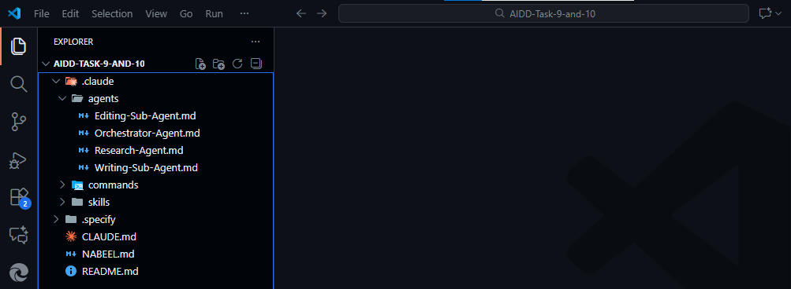
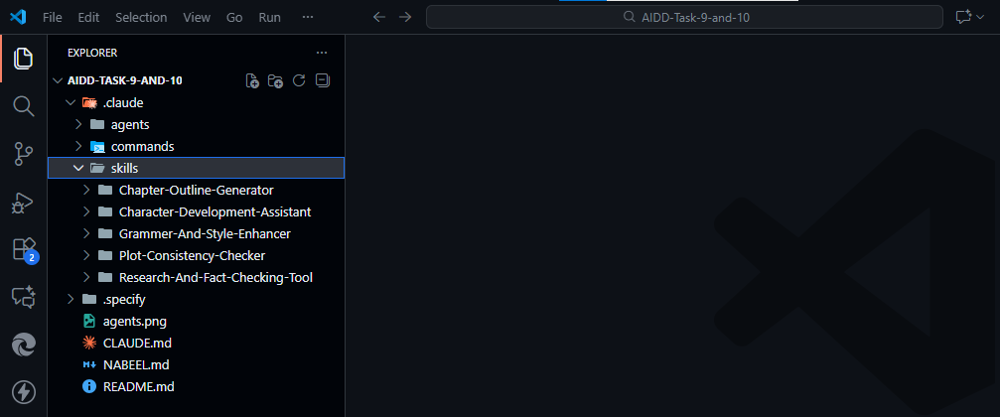

# AI-Driven Development — 30 Day Challenge  

> By Nabeel Ali

## 📍 Project Overview  

This repository holds my journey and work for the **30-Day Challenge** of "AI-Driven Development". Over the course of 30 days I aim to explore, implement and document different AI-driven development techniques, tools and tasks. Each day features a distinct task, milestone or deliverable in PDF format (or similar), enabling me to build skills and show progress.

## ✅ Completed Tasks (1-10)

### 📄 Deliverables

- **Task 1:** [AIDD-Task-1.pdf](AIDD-Task-1.pdf)
- **Task 2:** [AIDD-Task-2.pdf](AIDD-Task-2.pdf)
- **Task 3:** [AIDD-Task-3.pdf](AIDD-Task-3.pdf)
- **Task 4:** [AIDD-Task-4](AIDD-Task-4)
- **Task 5:** [AIDD-Task-5](AIDD-Task-5)
- **Task 6:** [AIDD-Task-6](AIDD-Task-6)
- **Task 7:** [AIDD-Task-7](AIDD-Task-7)
- **Task 8:** [AIDD-Task-8](AIDD-Task-8)
- **Task 9 & 10:** [AIDD-Task-9-and-10](AIDD-Task-9-and-10)

### 🖼️ Task 9 & 10 Proof

**Agents:**


**Skills:**


## 🎯 Objectives & Goals

- Learn and apply **AI-assisted development workflows**, e.g., prompt-engineering, code generation, automated testing, intelligent debugging.  
- Document outcomes clearly (via PDFs) to track what was done, what succeeded, what didn’t, and what next steps are.  
- Build a portfolio of real tasks showing hands-on experience with AI-driven development geared for full-stack/Next.js/TypeScript workflows (which align with my skills & interests).  
- Share insights and reflections at the end of the challenge to help others learning similar paths.

## 🔧 Technologies & Skills

- **Core Stack**: Next.js, TypeScript, HTML, CSS, JavaScript (since I am a developer focusing on these technologies)  
- **AI/ML Tools & Concepts**: (examples) prompt engineering, LLMs, code-generation tools, AI-powered dev assistants  
- **Workflow & Documentation**: GitHub for version control, PDF deliverables for each task, README for project overview  
- **Design Style**: I prefer a simple, dark, unique theme for UI work and code samples — consistent with my brand.

## 🗂 How to Use This Repo

1. Clone the repository:  

   ```bash
   git clone https://github.com/NabeelManjhoti/AI-Drivern-Development----30-Day-Challenge.git
